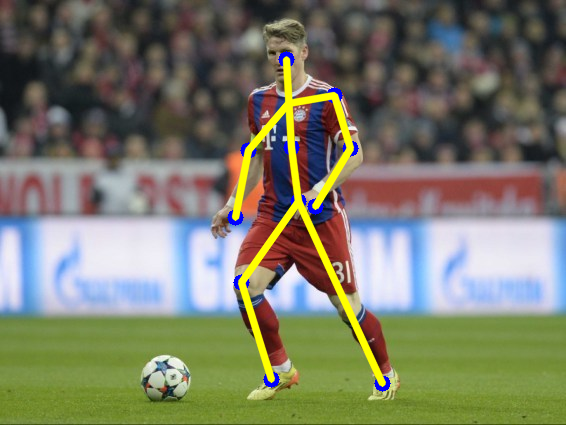

# 2D Pose using YOLO.

 I was wondering if one could use an object detection algorithm like YOLO to be trained to detect Human Body parts ?  

 Thus, the answer to the above question is the work of this project.

  

 There are many implementations of YOLOv3 network, the most famous of them all is the work of [AlexeyAB] (https://github.com/AlexeyAB/darknet) Darknet Framework. 
 
 (Hey! if you are not familiar with YOLO, [here](https://medium.com/analytics-vidhya/yolo-you-look-only-once-9af63cb143b7) is a blog on it written by me

## The project pipeline can be explained in 3 different steps.

1. Data Preparation and Network Configuration.
2. YOLO Training and setting up of CUDA.
3. Post processing.

## Data Preparation and Network Configuration.

#### 1. Data Collection:

The first step in this project is to collect images/data required to train our YOLO network. The quality & quantity of data is very essential resource to our Deep Learning network. Unfortunately, I was unable to nail this key strategy in figuring out the precise number and the diversity of images required to train my YOLO network. 

I have collected ___ (DASH) number of images which consists of footballers in action, converting two videos in frames. I could managed to obtain about 600 or so images in total. 

#### 2. Annotating the images: 

+ There are many annotation tools like VGG, VoTT & many more. Each software creates the annotated output in a certain format specific to it. The YOLOv3 implementation I have used requires the annotations created & the data to be arranged in this format.
	- Training data
		- --Data 
		- --filename.data
		- --filename.names
		- --train.txt
		- --test.txt
		- --yolo_network.cfg

	- Each image in the Data folder must have a text file with the same filename. 
	- The text file contains the annotations created on the image. 
	- Each annotation is this format :
		- box1_class box1_x box1_y box1_w box1_h. 
		- box2_class box2_x box2_y box2_w box2_h.
		- .
		- .
	- box_x & box_y are the centroid locations of the box, box_w & box_h are the box width and height. 

	- filename.data or .data file contains pathname to locate the train.txt & test.txt file inside the darknet framework. Along with it the number of classes & the path to the backup folder where the trained weights are saved once training is finished. 

	- filename.names file or .names file contains the class names that the network is going to be trained on. For example, in my case the class names would be Head,RightShoulder,RightKnee & so on. 

	- train.txt & test.txt contains the pathname to the training images & testing images respectively. 
	
	- yolo_net.cfg file describes the YOLO network architecture. 

#### 3.YOLO Network configuration. 

+ cfg file describes certain network parameters and the network architecture. When training the network on custom object classes, it is necessary to make a few changes to the configuration file suitable for the dataset. 

	- Change the number of classes, in my case 13. 
	- Change the anchors to values specific to the dataset. (Optional)
	- Change the number of filters in 3 convolutional layers preceeding the YOLO layer to the number 		obtained from (classes+5) * 3.
	- Adjust the input width and height of the network to multiples of 32. The values are either 416x416, 608x608 or 832x832. Bigger the input size, more precise and accurate the predictions are. 
	- Add flip=0 after hue parameter.
	- Increase or decrease the batch size.
	- Adjust the subdivisions field. 

## YOLO Training and setting up of CUDA.

+ I don't have a local GPU machine which makes me dependent to use [Google Colab Services](https://colab.research.google.com/notebooks/intro.ipynb). Google Colab offers each user 12-hour runtime which allows users to train our network with the data saved in the Colab VM for 12 hours. 

+ The training data can be loaded into the Colab VM in two ways
	- Load the training data either cloning a GitHub repo into the VM.
	- Upload the data to Google Drive, mounting Google Drive on Colab. 
+ Cloning Darknet Repo into Colab VM. 
+ Installing CUDA drivers. 

+ The next step is training the network. The notebook is available for use. 

+ Once trained for the required number of iterations, stop the execution and download the .weights file present inside backup folder of the VM. The weights file will then be used in the Post Processing step. 

## Post processing.

After training the network, it is necessary to evaluate the strength and shortcomings of the network. Darknet allows you to test your trained network or one can use OpenCV library to read and load pre-trained weights for a DNN. In both cases, the cfg file its corresponding weights file is needed.

DNN module in OpenCV helps you create an instance of network with the given configuration. Weights can be initialized too. This network can be evaluated by the output it gives for the input. We can modify the way we render the output bounding box, in my case I chose to represent the keypoints/bodyparts detected with a circle rather than a rectangular bounding box. 

